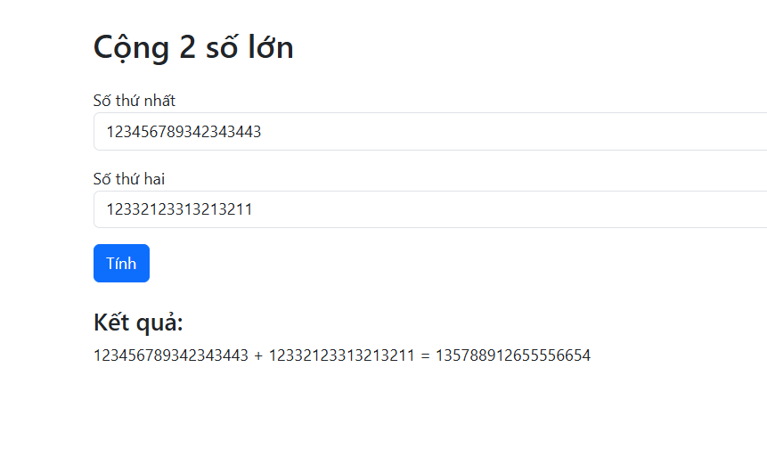

# Big Number Sum - Spring Boot Web Application

## 1. Giới thiệu

Đây là ứng dụng Web đơn giản cho phép người dùng thực hiện **phép cộng hai số lớn** (Big Number) được biểu diễn dưới dạng chuỗi.

Thuật toán được cài đặt thủ công theo cách học sinh Tiểu học:

* Cộng từ phải sang trái
* Có xử lý số nhớ (carry)
* Không sử dụng `BigInteger`

---

## 2. Công nghệ sử dụng

* Java (Core)
* Spring Boot
* Thymeleaf
* Bootstrap
* Maven

---

## 3. Chức năng chính

* Nhập 2 số bất kỳ (độ dài lớn)
* Cộng số bằng thuật toán custom
* Hiển thị kết quả trên giao diện web
* Validate chỉ cho phép nhập số
* Ghi log từng bước phép cộng

---

## 4. Cấu trúc project

```
src/
 ├── main/
 │   ├── java/
 │   │   ├── controller/
 │   │   ├── service/
 │   │   └── util/
 │   │        └── MyBigNumber.java
 │   └── resources/
 │        └── templates/
 │             └── index.html
 │
 ├── test/ (nếu có unit test)
 │
pom.xml
README.md
```

---

## 5. Hướng dẫn chạy project

### Bước 1: Clone project

Mở Terminal / CMD và chạy:

```
git clone https://github.com/LeThanhThien2k4/Add2Num.git
```

---

### Bước 2: Mở project

* Mở IntelliJ IDEA
* Chọn **Open**
* Chọn thư mục vừa clone

---

### Bước 3: Cài dependencies

Nếu dùng Maven:

* IntelliJ sẽ tự load dependencies
* Nếu chưa, click:

  ```
  Maven → Reload Project
  ```

---

### Bước 4: Chạy ứng dụng

* Tìm file:

  ```
  Application.java
  ```
* Click **Run**

---

### Bước 5: Truy cập web

Mở trình duyệt:

```
http://localhost:8080
```

---

## 6. Cách sử dụng

1. Nhập số thứ nhất
2. Nhập số thứ hai
3. Nhấn nút **Tính**
4. Xem kết quả hiển thị bên dưới

---
## Demo giao diện



---

## 7. Ví dụ test

| Input       | Output |
| ----------- | ------ |
| 1234 + 897  | 2131   |
| 999 + 1     | 1000   |
| 1000 + 9999 | 10999  |

---

## 8. Logging

Ứng dụng ghi lại từng bước phép cộng trong console:

Ví dụ:

```
Bước 1: 4 + 7 = 11 → ghi 1, nhớ 1
Bước 2: 3 + 9 + 1 = 13 → ghi 3, nhớ 1
...
```

---

## 9. Validate dữ liệu

* Chỉ cho phép nhập số (0-9)
* Nếu nhập ký tự khác → hiển thị lỗi

---

## 10. Version

Phiên bản hiện tại:

```
v0.0.1
```

---

## 11. Tác giả

* Name: Le Thanh Thien
* GitHub: https://github.com/LeThanhThien2k4

---

## 12. Ghi chú

* Project phục vụ mục đích học tập và demo thuật toán
* Có thể mở rộng:

  * Trừ số lớn
  * Nhân số lớn
  * API REST thay vì UI
